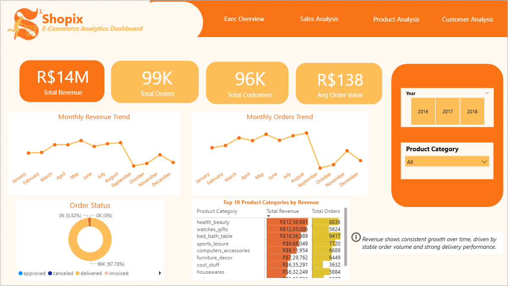
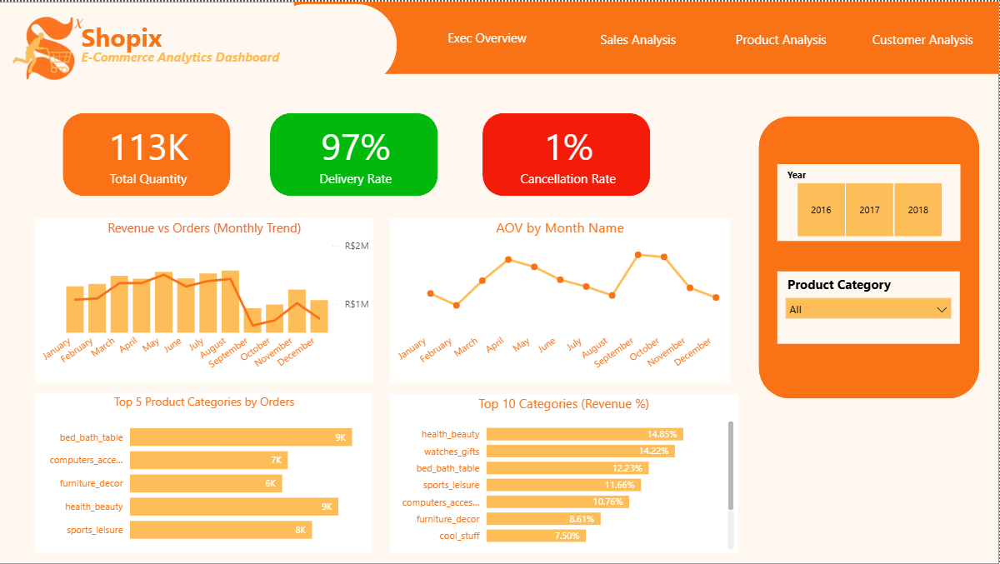
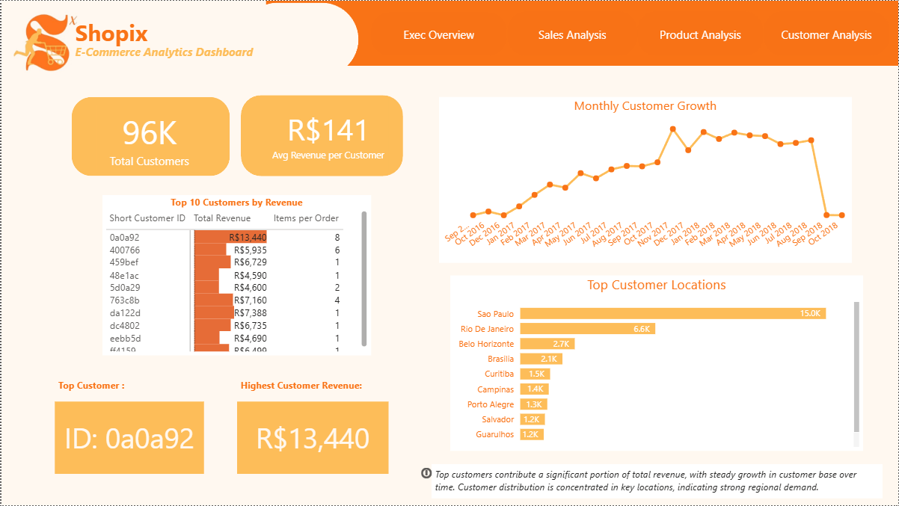
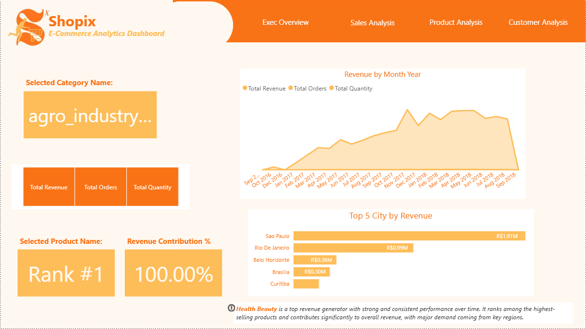

# E-commerce Sales Dashboard (Retail Domain) | Power BI  

## 📊 Project Overview  
This project focuses on analyzing e-commerce sales data to identify key trends, top-performing categories, and revenue patterns. The goal is to provide actionable insights to support business decision-making.

## 🛠 Tools Used  
- Power BI  
- Power Query (Data Cleaning & Transformation)  
- DAX (Data Modelling & KPIs)  

## 📈 Key Insights  
- Identified top-performing product categories contributing maximum revenue  
- Analyzed monthly and regional sales trends  
- Detected high-value customer segments and purchasing patterns  
- Highlighted areas for improving sales performance  

## 📷 Dashboard Preview  
### Executive Overview  

### Sales Analysis  

### Customer Analysis  

### Product Analysis  

## 🎥 Project Demo  
[Watch Demo](https://bit.ly/49icBIb)

## 📁 Dataset  
Dataset sourced from Kaggle and used for data analysis and dashboard development
